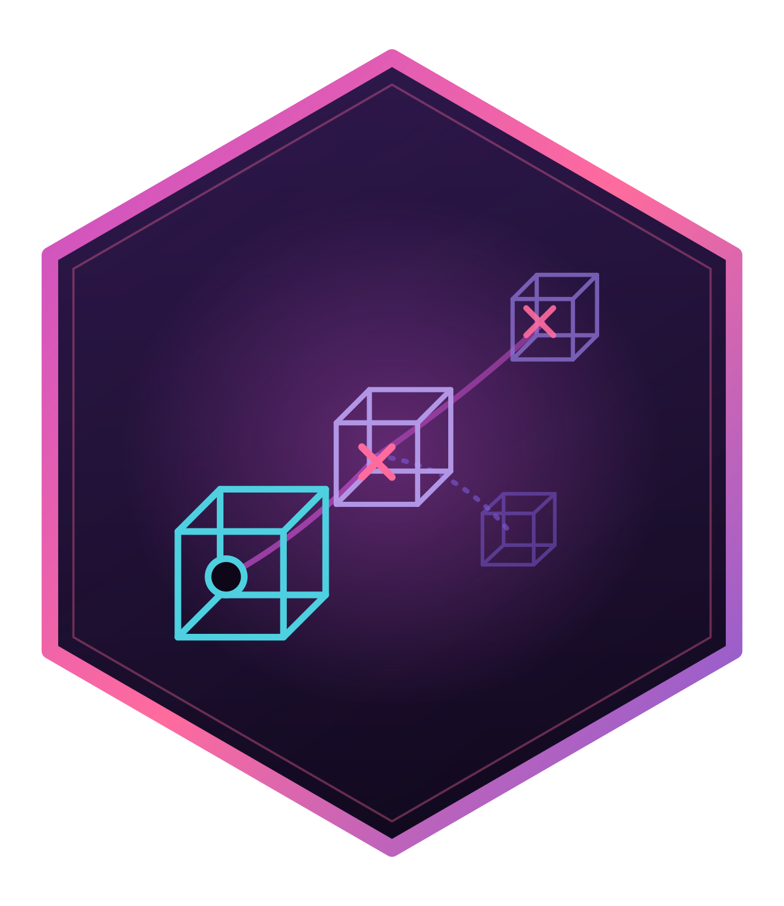

# multixoR <a href="https://r-heller.github.io/multixoR/"></a>

> Five-dimensional, multiverse tic-tac-toe in R. A pure-R engine,
> incremental cross-axis win detection, evaluation + MCTS, batch self-play,
> calibration, ggplot2/plotly visualisation, and a bundled Shiny app.

[](https://github.com/r-heller/multixoR/actions/workflows/R-CMD-check.yaml)
[](https://github.com/r-heller/multixoR/actions/workflows/pkgdown.yaml)
[](https://opensource.org/licenses/MIT)
[](https://lifecycle.r-lib.org/articles/stages.html)

## What

`multixoR` is a five-dimensional, multiverse variant of tic-tac-toe.
Two players place marks on a 4×4×4 spatial cube. Beyond the three spatial
axes, play extends across a **time** axis (successive board states) and a
**timeline** axis (parallel, branching universes). A player wins by
completing a length-3 line of their own colour along *any* axis or
diagonal — including lines that run through time and across timelines.

A player may place a mark into an empty cell of a *past* board state;
doing so spawns a **new branching timeline** from that point, leaving the
original timeline untouched. Branching is unrestricted.

The full spec lives in [`pipeline/multixoR_GAME_RULES.md`](pipeline/multixoR_GAME_RULES.md).

## Install

```r
# install.packages("remotes")
remotes::install_github("r-heller/multixoR")
```

## Quick start

```r
library(multixoR)

g <- mxo_new_game()
g <- mxo_move(g, "present", L_src = 0L, t_src = 0L, idx = 0L)   # X at (0,0,0)
g <- mxo_move(g, "present", L_src = 0L, t_src = 1L, idx = 16L)  # O somewhere
g <- mxo_move(g, "branch",  L_src = 0L, t_src = 0L, idx = 63L)  # X branches to L1

mxo_to_move(g)    # 2 -> O
mxo_status(g)     # status: in_progress, no winning line yet
mxo_legal_moves(g)
```

Evaluate, search, and rate:

```r
mxo_evaluate(g)                                # heuristic score
mxo_search(g, depth = 1L, branch_policy = "none")$move
mxo_win_prob(g, method = "heuristic")
mxo_rate_moves(g, method = "heuristic")        # type-stable table
mxo_ai_move(g, difficulty = "medium", seed = 1L)
```

Simulate self-play and analyse:

```r
sim <- mxo_simulate(
  mxo_policy("random"), mxo_policy("random"),
  n_games = 30L,
  config = mxo_config_default(n = 3L, k = 3L, ply_cap = 12L),
  seed = 1L
)
summary(sim)

mxo_opening_table(opponent = mxo_policy("random"),
                  n_games_per_cell = 5L,
                  config = mxo_config_default(n = 3L, k = 3L, ply_cap = 10L))
```

Visualise:

```r
ggplot2::autoplot(g)                # multiverse overview
ggplot2::autoplot(g, type = "board", L = 0L, t = 0L)
ggplot2::autoplot(g, type = "threats")
mxo_plot_tree(g)
```

Launch the Shiny app (`shiny`, `bslib`, `DT` are `Suggests`):

```r
mxo_run_app()
```

## Design highlights

- **One engine, one evaluator.** Every stack (app, simulation, analysis)
  calls the same `mxo_evaluate()` / `mxo_win_prob()` so ratings stay
  consistent.
- **Generic `n^d` geometry.** The engine is parameterised by `(n, d_spatial,
  k)`; the canonical 4³/k=3 config is the default, never a hardcoded
  constant in the logic.
- **Placement-anchored win detection.** Wins must pass through the most
  recent placement; propagation alone never completes a line. See rules §5.2.1.
- **Rcpp-ready hot loop.** The line-feature enumerator runs in vectorised
  R for v1.0; the inner loop is structured so a future Rcpp backend is a
  drop-in.
- **B↔C calibration handshake.** The default win-probability calibrator
  (`R/sysdata.rda`) is fit from self-play data via
  `data-raw/make_calibrator.R` and consumed by `mxo_win_prob()`.

## Project layout

```
R/                  # package source
tests/testthat/     # tests
data-raw/           # offline scripts (calibrator fit)
inst/shiny/multixoR # bundled app
pipeline/           # the build orchestrator and the rules spec
```

## License

MIT (c) 2026 Raban Heller.
