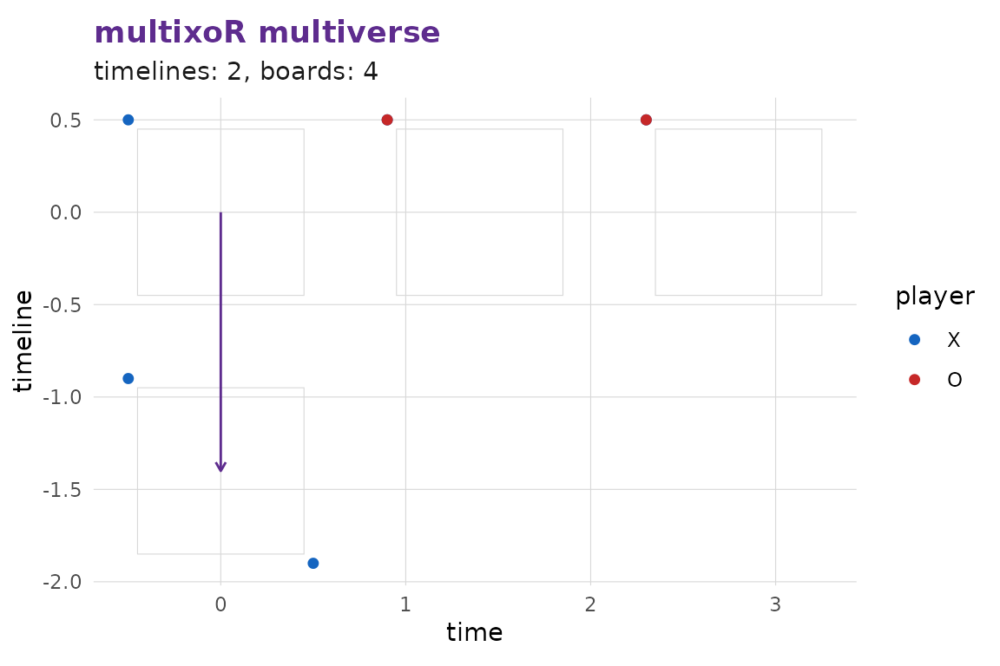
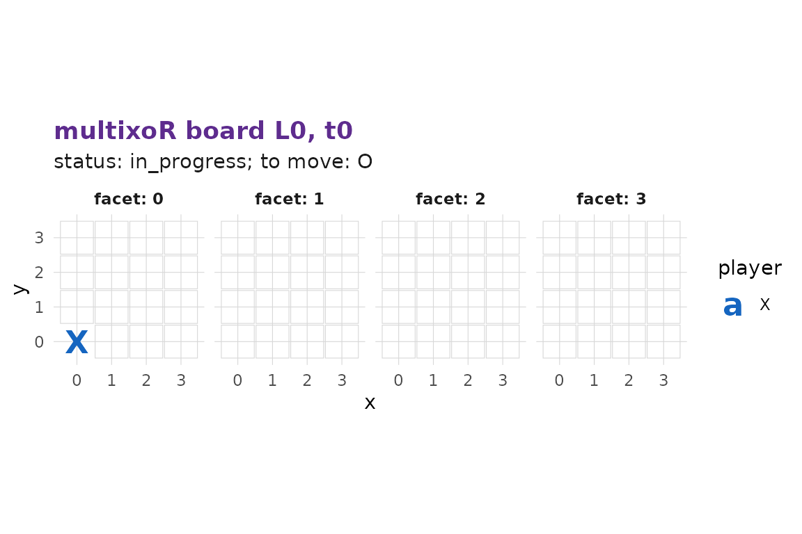
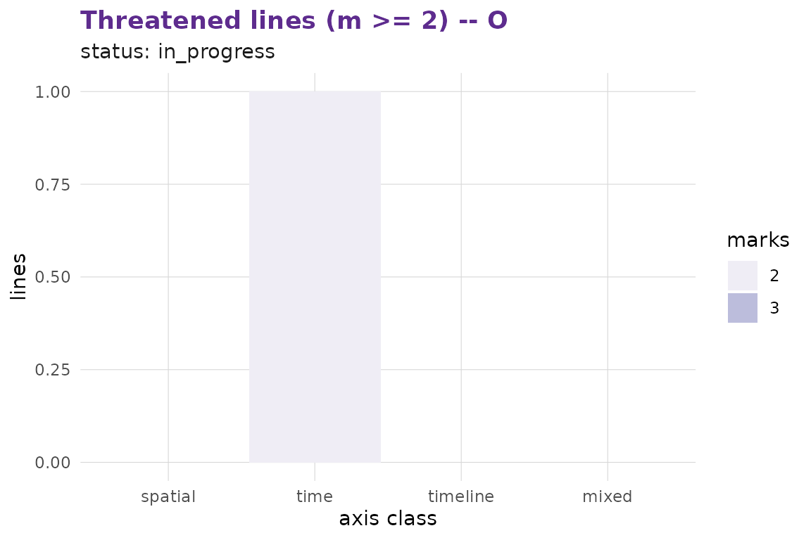

# Getting started with multixoR

`multixoR` is a five-dimensional, multiverse variant of tic-tac-toe. Two
players place marks on a 4×4×4 spatial cube; play also extends across a
**time** axis (successive board states) and a **timeline** axis
(parallel, branching universes). A player wins by making a length-3 line
of their own colour along any axis or diagonal — including lines that
traverse time or timelines.

``` r

library(multixoR)

g <- mxo_new_game()
mxo_to_move(g)
#> [1] 1
nrow(mxo_legal_moves(g))
#> [1] 64
```

## Two kinds of move

A **present** move places the player’s mark on an empty cell of the
current present board and advances time by one step.

``` r

g <- mxo_move(g, "present", L_src = 0L, t_src = 0L, idx = 0L)   # X at (0,0,0)
g <- mxo_move(g, "present", L_src = 0L, t_src = 1L, idx = 16L)  # O somewhere
mxo_history(g)
#> # A tibble: 2 × 8
#>     ply player kind    L_src t_src   idx L_new t_new
#>   <int>  <int> <chr>   <int> <int> <int> <int> <int>
#> 1     1      1 present     0     0     0    NA     0
#> 2     2      2 present     0     1    16    NA     1
```

A **branch** move places into an empty cell of a *past* board and spawns
a new timeline that copies the source board plus the new mark. The
source timeline is left untouched.

``` r

g <- mxo_move(g, "branch", L_src = 0L, t_src = 0L, idx = 63L)
mxo_timelines(g)
#> # A tibble: 2 × 4
#>       L parent branch_t present_t
#>   <int>  <int>    <int>     <int>
#> 1     0     NA       NA         2
#> 2     1      0        0         0
```

## Analysis

Every analysis function in the package consumes the engine’s state
object directly — there is no parallel implementation.

``` r

mxo_evaluate(g)
#> [1] -80
mxo_win_prob(g, method = "heuristic")
#> [1] 0.542697
```

[`mxo_rate_moves()`](https://r-heller.github.io/multixoR/reference/mxo_rate_moves.md)
returns the type-stable per-move table the visualisation stack and the
Shiny app consume; for the 4³ default it can be slow under the pure-R
engine, so this vignette demonstrates it on a 3³ position.

``` r

small <- mxo_new_game(n = 3L, k = 3L)
small <- mxo_move(small, "present", 0L, 0L, 0L)
head(mxo_rate_moves(small, method = "heuristic"), 6L)
#> # A tibble: 6 × 9
#>   kind    L_src t_src   idx player score win_prob  rank label
#>   <chr>   <int> <int> <int>  <int> <dbl>    <dbl> <int> <chr>
#> 1 present     0     1     1      2   -78    0.543    41 best 
#> 2 present     0     1     2      2   -70    0.543    28 best 
#> 3 present     0     1     3      2   -78    0.543    41 best 
#> 4 present     0     1     4      2   -72    0.543    35 best 
#> 5 present     0     1     5      2   -78    0.543    41 best 
#> 6 present     0     1     6      2   -70    0.543    28 best
```

## Visualisation

[`autoplot()`](https://ggplot2.tidyverse.org/reference/autoplot.html) is
the ergonomic dispatcher; the more specific renderers are also exported.

``` r

library(ggplot2)
autoplot(g)                                # multiverse overview
```



``` r

autoplot(g, type = "board", L = 0L, t = 0L)
```



``` r

autoplot(g, type = "threats")
```



## App

[`mxo_run_app()`](https://r-heller.github.io/multixoR/reference/mxo_run_app.md)
launches a bundled Shiny app for interactive play and analysis. Requires
the optional packages `shiny`, `bslib`, and `DT` (in `Suggests`).

``` r

mxo_run_app()
```
