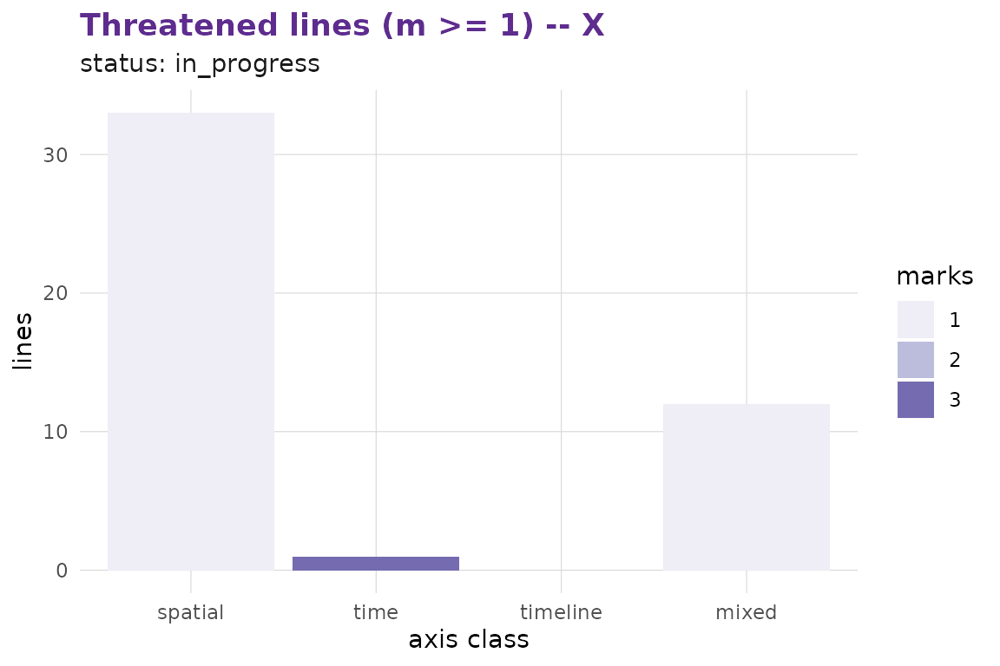

# Rules and 5D geometry

[](https://github.com/r-heller/multixoR/actions/workflows/R-CMD-check.yaml)
[](https://r-heller.github.io/multixoR/)
[](https://CRAN.R-project.org/package=multixoR)
[](https://app.codecov.io/gh/r-heller/multixoR?branch=main)
[](https://cran.r-project.org/package=multixoR)
[](https://cran.r-project.org/package=multixoR)
[](https://opensource.org/licenses/MIT)
[](https://lifecycle.r-lib.org/articles/stages.html#experimental)

## Five axes

`multixoR` is played in five dimensions. Three are spatial (`x`, `y`,
`z`) and define a `4×4×4` cube of 64 cells. The fourth axis is **time**
(`t`), a sequence of board snapshots within one timeline. The fifth is
the **timeline** (`L`) axis: every branching move spawns a new universe
whose boards live at parallel `L` labels.

A canonical address is the 5-tuple `(L, t, x, y, z)`. The engine works
generically over `(n, d_spatial, k)` — the default `4³` / `k = 3` is the
declared configuration, never a hardcoded constant.

``` r

cfg <- mxo_config(mxo_new_game())
cfg
#> $n
#> [1] 4
#> 
#> $d_spatial
#> [1] 3
#> 
#> $k
#> [1] 3
#> 
#> $ply_cap
#> [1] 60
#> 
#> $max_timelines
#> [1] 32
```

## Directions and winning lines

A direction is a 5-vector in `{-1, 0, +1}` minus the all-zero vector,
canonicalised so the first non-zero component is positive. The total
number of canonical directions in `d_spatial + 2 = 5` axes is
`(3^5 − 1) / 2 = 121`.

``` r

nrow(multixoR:::.mxo_directions(3L))
#> [1] 121
```

A winning line is any three same-colour, existence-gated cells along a
canonical direction. The §5.2.1 amendment in the spec restricts wins to
extents that **pass through the most recent placement** — propagated
cells alone never declare a win.

## Branching across timelines

``` r

g <- mxo_new_game()
g <- mxo_move(g, "present", 0L, 0L, 0L)   # X at (0,0,0)
g <- mxo_move(g, "present", 0L, 1L, 16L)  # O somewhere
g <- mxo_move(g, "branch",  0L, 0L, 63L)  # X branches to L1
mxo_timelines(g)
#> # A tibble: 2 × 4
#>       L parent branch_t present_t
#>   <int>  <int>    <int>     <int>
#> 1     0     NA       NA         2
#> 2     1      0        0         0
```

[`mxo_plot_multiverse()`](https://r-heller.github.io/multixoR/reference/mxo_plot_multiverse.md)
lays every board out on a timeline × time grid and draws the branch
connectors:

``` r

mxo_plot_multiverse(g)
```


## Three timeline-axis placements → win

A pure `dL`-axis win requires three placements at the **same**
`(t, idx)` on three adjacent timelines. The example below branches three
times from the empty initial board at the same spatial cell.

``` r

w <- mxo_new_game()
w <- mxo_move(w, "present", 0L, 0L, 0L)
w <- mxo_move(w, "present", 0L, 1L, 1L)
w <- mxo_move(w, "branch",  0L, 0L, 63L)
w <- mxo_move(w, "present", 0L, 2L, 16L)
w <- mxo_move(w, "branch",  0L, 0L, 63L)
w <- mxo_move(w, "present", 0L, 3L, 17L)
w <- mxo_move(w, "branch",  0L, 0L, 63L)
mxo_status(w)$status
#> [1] "x_win"
```

The same engine, geometry, and win-check produce all five axis-class
wins;
[`mxo_plot_threats()`](https://r-heller.github.io/multixoR/reference/mxo_plot_threats.md)
shows the per-axis-class threatened-line count that drives strategic
play.

``` r

mxo_plot_threats(g, player = 1L, min_marks = 1L)
```


