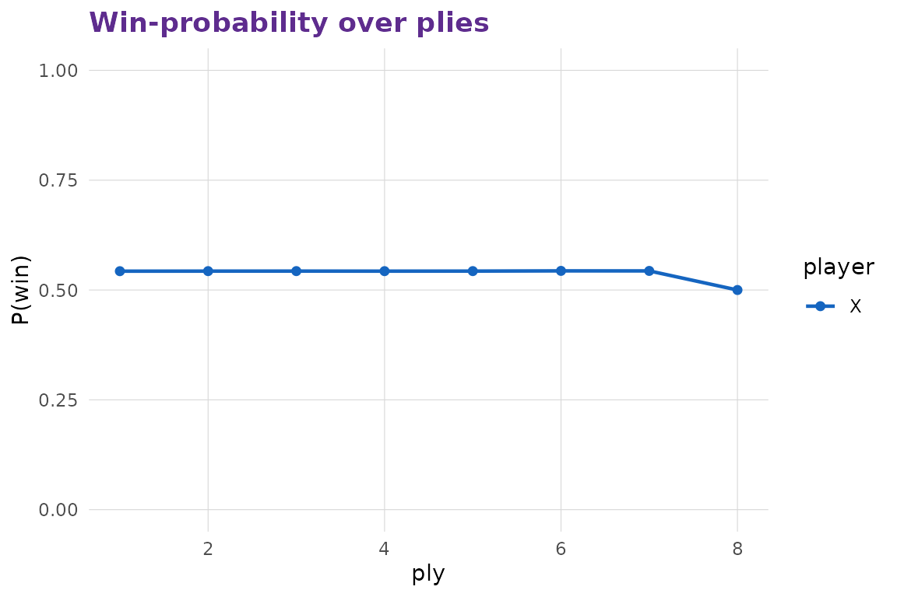
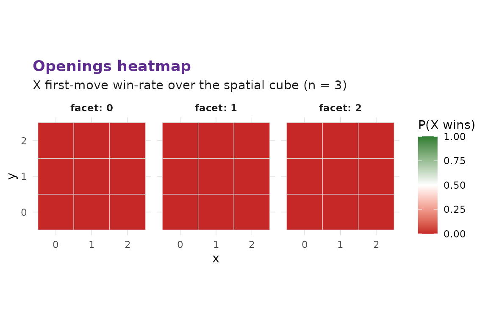

# Self-play, simulation, and the §12 timeline-win finding

## Policies

A policy is a parameterised picker function over Stack B’s searchers.

``` r

mxo_policy("random")
#> 
#> ── multixoR policy ─────────────────────────────────────────────────────────────
#> ℹ Type: random
mxo_policy("heuristic", branch_policy = "none")
#> 
#> ── multixoR policy ─────────────────────────────────────────────────────────────
#> ℹ Type: heuristic
#> ℹ Params:
#> →   branch_policy = none
```

## Single self-play game

[`mxo_self_play()`](https://r-heller.github.io/multixoR/reference/mxo_self_play.md)
returns an `mxo_game_record` that includes the per-ply heuristic score
and the heuristic win probability (X perspective). Those two columns are
exactly what the win-probability curve consumes.

``` r

rec <- mxo_self_play(
  mxo_policy("random"), mxo_policy("random"),
  config = mxo_config_default(n = 3L, k = 3L, ply_cap = 8L),
  seed = 1L
)
rec
#> 
#> ── multixoR game record ────────────────────────────────────────────────────────
#> ℹ Outcome: draw (winner: NA)
#> ℹ Plies: 8; timelines: 3
#> ℹ Win axis: NA
head(as_tibble.mxo_game_record(rec), 6L)
#> # A tibble: 6 × 9
#>     ply player kind    L_src t_src   idx L_new  eval win_prob
#>   <int>  <int> <chr>   <int> <int> <int> <int> <dbl>    <dbl>
#> 1     1      1 present     0     0    24    NA    14    0.543
#> 2     2      2 present     0     1     3    NA    78    0.543
#> 3     3      1 branch      0     0    13     1   104    0.543
#> 4     4      2 present     0     2     0    NA    52    0.543
#> 5     5      1 present     1     0     9    NA    98    0.543
#> 6     6      2 present     1     1    20    NA   369    0.544
```

``` r

mxo_plot_win_prob(rec)
```



## Batch simulation

[`mxo_simulate()`](https://r-heller.github.io/multixoR/reference/mxo_simulate.md)
runs many self-play games with reproducible per-game sub-seeds. The
summary surfaces the §12 stress-test number — the **fraction of decisive
games whose winning line crosses timelines** — the diagnostic the
orchestrator flagged as the rules’ main balance concern.

``` r

# Tiny `n_games` to keep the vignette build well under a minute on the
# pure-R engine; bump these up for real analyses.
sim <- mxo_simulate(
  mxo_policy("random", branch_policy = "all"),
  mxo_policy("random", branch_policy = "all"),
  n_games = 6L,
  config = mxo_config_default(n = 3L, k = 3L, ply_cap = 6L),
  seed = 7L, record_eval = FALSE, progress = FALSE
)
summary(sim)
#> 
#> ── multixoR simulation summary ─────────────────────────────────────────────────
#> ℹ Games: 6
#> ℹ Win rates: X = 0; O = 0; draws = 1
#> ℹ Mean plies: 6; mean timelines: 4.33
#> ℹ Cross-timeline-win fraction: NA
```

[`mxo_timeline_win_rate()`](https://r-heller.github.io/multixoR/reference/mxo_timeline_win_rate.md)
returns the same number with a per-axis-class breakdown.

``` r

mxo_timeline_win_rate(
  mxo_policy("random"), mxo_policy("random"),
  n_games = 6L,
  config = mxo_config_default(n = 3L, k = 3L, ply_cap = 6L),
  seed = 7L
)
#> # A tibble: 1 × 8
#>   n_games n_wins cross_timeline_wins cross_timeline_fraction spatial  time
#>     <int>  <int>               <int>                   <dbl>   <int> <int>
#> 1       6      0                   0                      NA       0     0
#> # ℹ 2 more variables: timeline <int>, mixed <int>
```

## Openings heatmap

[`mxo_opening_table()`](https://r-heller.github.io/multixoR/reference/mxo_opening_table.md)
plays X’s first move from each spatial cell against a fixed opponent.
[`mxo_plot_opening()`](https://r-heller.github.io/multixoR/reference/mxo_plot_opening.md)
renders the resulting win-rate heatmap as Z-slices.

``` r

tab <- mxo_opening_table(
  opponent = mxo_policy("random"),
  n_games_per_cell = 1L,
  config = mxo_config_default(n = 3L, k = 3L, ply_cap = 4L),
  seed = 1L
)
mxo_plot_opening(tab, n = 3L, d_spatial = 3L)
```



## Calibration

[`mxo_make_calibration_data()`](https://r-heller.github.io/multixoR/reference/mxo_make_calibration_data.md) +
[`mxo_fit_calibration()`](https://r-heller.github.io/multixoR/reference/mxo_fit_calibration.md)
produce the mapping the engine’s win-probability uses internally. The
script that fits the package default lives at
`data-raw/make_calibrator.R` and ships the result to `R/sysdata.rda`.
