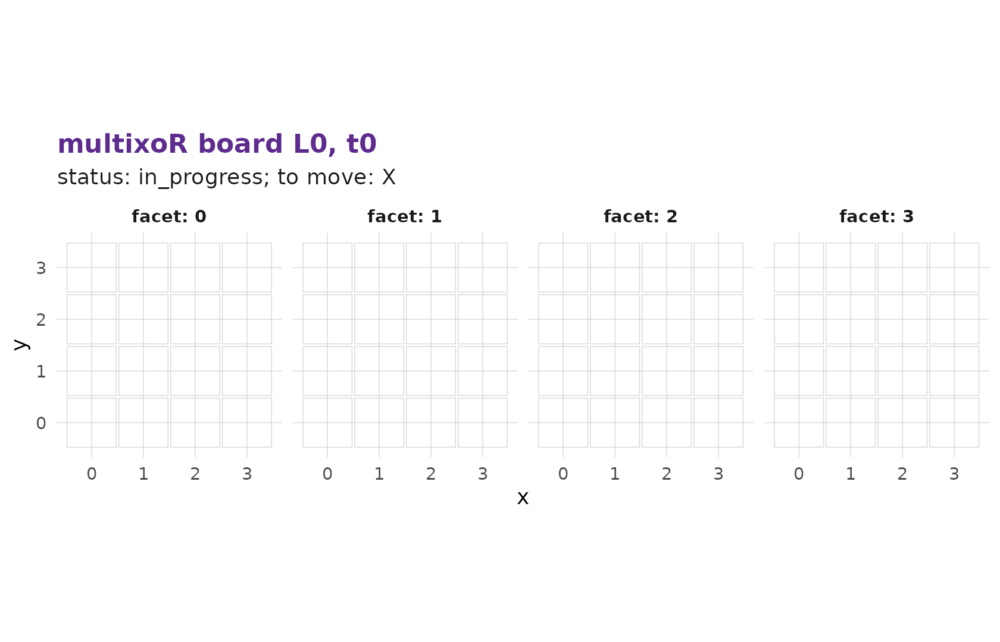

# 1. The board and the five axes

This is the first page of a six-part tutorial on how to play
**multixoR**, a five-dimensional, multiverse variant of tic-tac-toe. We
start with the question every player asks first: *where, exactly, am I
placing my marks?*

``` r

install.packages("remotes")
remotes::install_github("r-heller/multixoR")
library(multixoR)
```

## The spatial cube

A single multixoR board is not a 3x3 grid. It is a `4x4x4` **cube** of
64 cells. Three of the game’s five axes are these spatial axes – `x`,
`y`, and `z`.

Every game carries its geometry with it. The default configuration is
the canonical `4^3` cube with a winning-line length of `k = 3`:

``` r

g <- mxo_new_game()
mxo_config(g)
#> $n
#> [1] 4
#> 
#> $d_spatial
#> [1] 3
#> 
#> $k
#> [1] 3
#> 
#> $ply_cap
#> [1] 60
#> 
#> $max_timelines
#> [1] 32
```

The engine is generic over `(n, d_spatial, k)` – nothing in the rules
hard-codes the number 4 – but the canonical cube is the default, and the
one this tutorial uses.

### The cell index

Rather than typing three coordinates for every move, multixoR addresses
each cell of the cube with a single integer `idx` in `0..63`. The
mapping is

\texttt{idx} = x + n\\y + n^2 z \qquad (n = 4),

so `x` runs fastest. A few examples:

``` r

n <- 4L
cells <- expand.grid(x = 0:(n - 1), y = 0:(n - 1), z = 0:(n - 1))
cells$idx <- with(cells, x + n * y + n^2 * z)
head(cells[order(cells$idx), c("idx", "x", "y", "z")], 8)
#>   idx x y z
#> 1   0 0 0 0
#> 2   1 1 0 0
#> 3   2 2 0 0
#> 4   3 3 0 0
#> 5   4 0 1 0
#> 6   5 1 1 0
#> 7   6 2 1 0
#> 8   7 3 1 0
```

So `idx = 0` is the corner `(0,0,0)`, `idx = 1` is `(1,0,0)`, `idx = 16`
is `(0,0,1)` – one step along `z` – and `idx = 63` is the far corner
`(3,3,3)`.

### Seeing the cube

[`mxo_plot_board()`](https://r-heller.github.io/multixoR/reference/mxo_plot_board.md)
draws one board. The default `"slices"` view unfolds the cube into its
four `z`-layers, which is the easiest way to read a position:

``` r

mxo_plot_board(g, L = 0L, t = 0L)
#> Warning: No shared levels found between `names(values)` of the manual scale and the
#> data's colour values.
```



The `"cube"` view renders the same board as an interactive 3-D plotly
object – drag to rotate it:

``` r

mxo_plot_board(g, L = 0L, t = 0L, view = "cube")
```

An empty opening board is not very interesting. Here is the bundled
example game’s opening cube, which already has a handful of marks:

``` r

mxo_plot_board(mxo_example_game(), L = 0L, t = 0L, view = "cube")
```

## The fourth axis: time

multixoR is played in turns, and each board is a *snapshot* at one
moment. The sequence of snapshots within a single universe is the
**time** axis, `t`. Placing a mark produces a new board at the next time
step; earlier snapshots are never overwritten. We explore time properly
in [part
2](https://r-heller.github.io/multixoR/articles/tutorial-2-first-game.md).

## The fifth axis: timeline

The last axis is what makes multixoR a *multiverse* game. Placing a mark
into an empty cell of a **past** board spawns a brand-new, parallel
universe – a new **timeline**, labelled `L` – that copies the past board
plus your new mark, leaving the original timeline untouched. Branching
is covered in [part
3](https://r-heller.github.io/multixoR/articles/tutorial-3-branching.md).

## The full address

Putting it together, every cell in a multixoR game has a five-part
address:

(L,\\ t,\\ x,\\ y,\\ z) \\=\\ (\text{timeline},\\ \text{time},\\
\text{idx}).

Three spatial coordinates collapse into one `idx`, and the two extra
axes `L` and `t` say *which board* that cell lives on. Those five
numbers are the five dimensions in “five-dimensional tic-tac-toe”, and a
winning line may run along any of them.

------------------------------------------------------------------------

**Next:** [2. Playing your first game
→](https://r-heller.github.io/multixoR/articles/tutorial-2-first-game.md)
