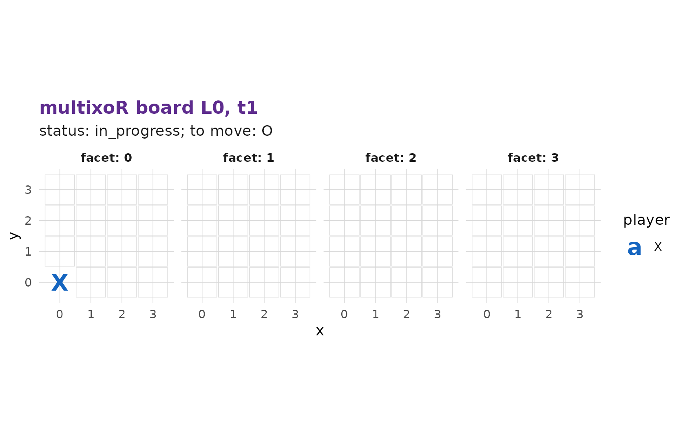
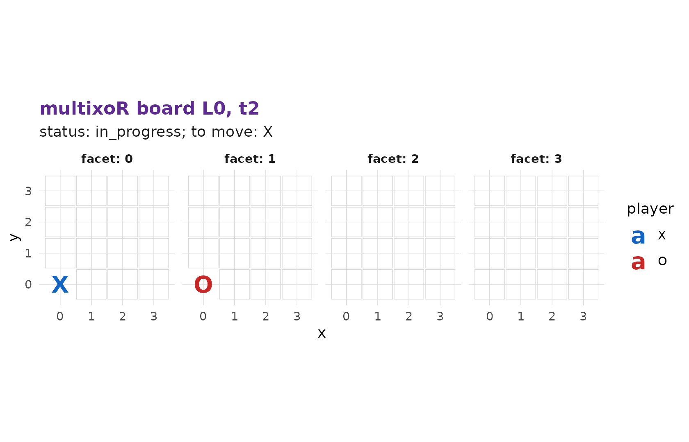
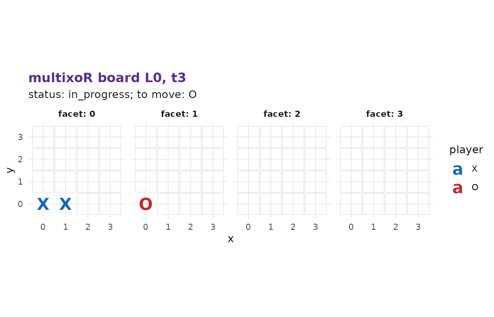

# 2. Playing your first game

In [part
1](https://r-heller.github.io/multixoR/articles/tutorial-1-the-board.md)
we met the board. Now we actually play. This page covers ordinary
turn-by-turn play within a single timeline – the **present** move – and
leaves branching for [part
3](https://r-heller.github.io/multixoR/articles/tutorial-3-branching.md).

## Starting a game

``` r

g <- mxo_new_game()
mxo_to_move(g)            # 1 = X moves first
#> [1] 1
nrow(mxo_legal_moves(g))  # every empty cell of the present board is legal
#> [1] 64
```

Player `1` is **X** and moves first; player `2` is **O**. On an empty
cube all 64 cells are available.

## The present move

A *present* move places your mark on an empty cell of the current
present board and advances time by one step. The call is

``` r

mxo_move(game, "present", L_src, t_src, idx)
```

where `(L_src, t_src)` is the board you are moving on – `L = 0`, the
current time `t`, for ordinary play – and `idx` is the cell. Let’s make
the first move: X takes the corner `idx = 0`, i.e. `(0,0,0)`.

``` r

g <- mxo_move(g, "present", L_src = 0L, t_src = 0L, idx = 0L)   # X (0,0,0)
mxo_plot_board(g)         # defaults to L = 0 and the present board
```



[`mxo_plot_board()`](https://r-heller.github.io/multixoR/reference/mxo_plot_board.md)
with no `t` shows the present snapshot, so X’s mark is already there. It
is now O’s turn:

``` r

mxo_to_move(g)
#> [1] 2
g <- mxo_move(g, "present", 0L, 1L, 16L)  # O (0,0,1): one step along z
mxo_plot_board(g)
```



Note the `t_src` climbed from `0` to `1`: each present move advances
time, so you always play on the latest board. X replies in the same
`x`-row, building toward a line:

``` r

g <- mxo_move(g, "present", 0L, 2L, 1L)   # X (1,0,0)
mxo_plot_board(g)
```



## Reading the history

Every ply is recorded.
[`mxo_history()`](https://r-heller.github.io/multixoR/reference/mxo_history.md)
returns the full move table:

``` r

mxo_history(g)
#> # A tibble: 3 × 8
#>     ply player kind    L_src t_src   idx L_new t_new
#>   <int>  <int> <chr>   <int> <int> <int> <int> <int>
#> 1     1      1 present     0     0     0    NA     0
#> 2     2      2 present     0     1    16    NA     1
#> 3     3      1 present     0     2     1    NA     2
```

[`mxo_status()`](https://r-heller.github.io/multixoR/reference/mxo_status.md)
summarises where the game stands:

``` r

mxo_status(g)
#> $status
#> [1] "in_progress"
#> 
#> $winner
#> [1] NA
#> 
#> $win_line
#> NULL
```

## Move notation

multixoR has a compact text notation for plies (rules section 8).
Serialize any record row with
[`mxo_format_ply()`](https://r-heller.github.io/multixoR/reference/mxo_format_ply.md):

``` r

h <- mxo_history(g)
for (i in seq_len(nrow(h))) cat(mxo_format_ply(as.list(h[i, ])), "\n")
#> X present @ (0,0) [0] 
#> O present @ (0,1) [16] 
#> X present @ (0,2) [1]
```

The form is `PLAYER kind @ (L,t) [idx]`.
[`mxo_parse_ply()`](https://r-heller.github.io/multixoR/reference/mxo_parse_ply.md)
is the exact inverse, turning a string back into a record:

``` r

mxo_parse_ply("X present @ (0,2) [1]")
#> $player
#> [1] 1
#> 
#> $kind
#> [1] "present"
#> 
#> $L_src
#> [1] 0
#> 
#> $t_src
#> [1] 2
#> 
#> $idx
#> [1] 1
#> 
#> $L_new
#> [1] NA
```

## Legal moves at any point

[`mxo_legal_moves()`](https://r-heller.github.io/multixoR/reference/mxo_legal_moves.md)
always lists exactly the moves available from the current state – the
engine never lets you play an illegal one (an occupied cell, for
instance, is rejected):

``` r

head(mxo_legal_moves(g), 5)
#> # A tibble: 5 × 5
#>   kind    L_src t_src   idx player
#>   <chr>   <int> <int> <int>  <int>
#> 1 present     0     3     2      2
#> 2 present     0     3     3      2
#> 3 present     0     3     4      2
#> 4 present     0     3     5      2
#> 5 present     0     3     6      2
```

So far we have only played in the present, in a single timeline. The
next page introduces the move that makes multixoR a multiverse game.

------------------------------------------------------------------------

**Previous:** [1. The board and the five
axes](https://r-heller.github.io/multixoR/articles/tutorial-1-the-board.md)
 \|  **Next:** [3. Branching into the past
→](https://r-heller.github.io/multixoR/articles/tutorial-3-branching.md)
