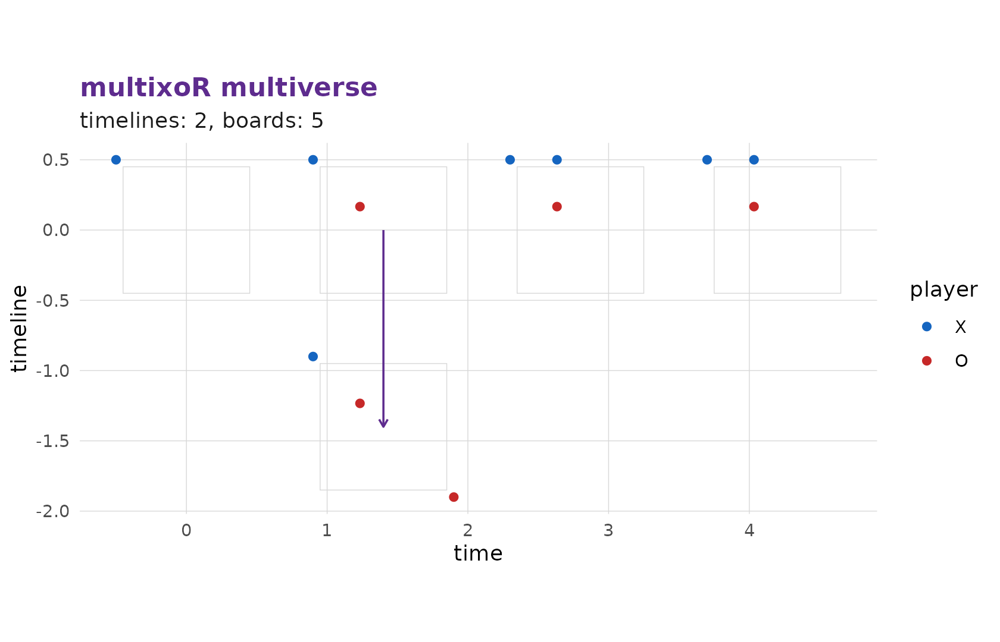
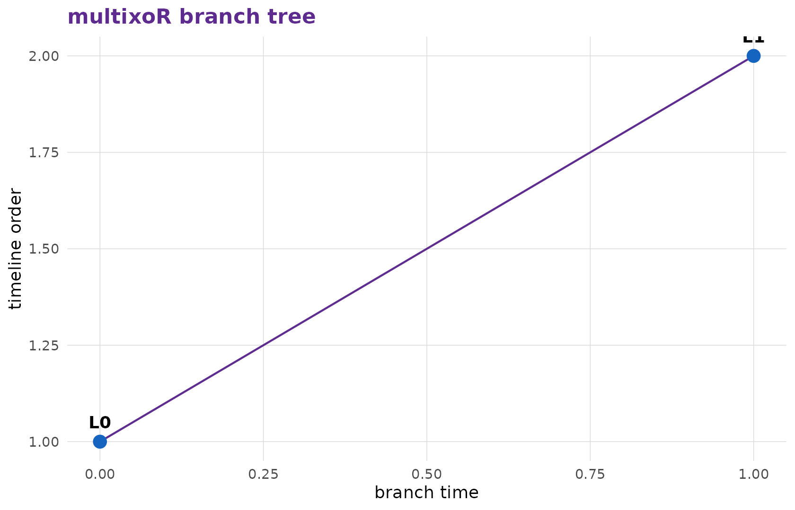

# 3. Branching into the past

So far ([part
2](https://r-heller.github.io/multixoR/articles/tutorial-2-first-game.md))
we only played present moves in a single universe. The **branch** move
is what turns multixoR into a multiverse game.

## What a branch does

A branch move places your mark into an empty cell of a **past** board.
Instead of editing history, it spawns a brand-new, parallel **timeline**
that copies that past board *plus* your new mark. The original timeline
is left completely untouched. Branching is unrestricted – you may branch
from any reachable past board, as often as you like.

The call mirrors a present move, but `kind = "branch"` and
`(L_src, t_src)` names the *past* board you are branching from:

``` r

mxo_move(game, "branch", L_src, t_src, idx)
```

## A worked branch

Let’s play three present moves and then branch from a past board. We
start in timeline `L = 0`:

``` r

g <- mxo_new_game()
g <- mxo_move(g, "present", 0L, 0L, 0L)   # X (0,0,0)
g <- mxo_move(g, "present", 0L, 1L, 5L)   # O (1,1,0)
g <- mxo_move(g, "present", 0L, 2L, 1L)   # X (1,0,0)
mxo_timelines(g)
#> # A tibble: 1 × 4
#>       L parent branch_t present_t
#>   <int>  <int>    <int>     <int>
#> 1     0     NA       NA         3
```

There is one timeline so far. Now X – rather, O is to move – branches
from the *past* board `(L = 0, t = 1)` by placing at the far corner
`idx = 63`:

``` r

g <- mxo_move(g, "branch", L_src = 0L, t_src = 1L, idx = 63L)
mxo_timelines(g)
#> # A tibble: 2 × 4
#>       L parent branch_t present_t
#>   <int>  <int>    <int>     <int>
#> 1     0     NA       NA         3
#> 2     1      0        1         1
```

A second timeline, `L = 1`, has appeared. It contains the board as it
stood at `t = 1` in timeline 0, plus O’s new mark at the corner – while
timeline 0 still carries on with its own history.

## Seeing the multiverse

[`mxo_plot_multiverse()`](https://r-heller.github.io/multixoR/reference/mxo_plot_multiverse.md)
lays every board out on a **timeline x time** grid and draws the branch
connectors, so you can see at a glance where universes split:

``` r

mxo_plot_multiverse(g)
```



[`mxo_plot_tree()`](https://r-heller.github.io/multixoR/reference/mxo_plot_tree.md)
shows the same branching as a tree of board states, which is often the
clearest way to follow how the timelines relate:

``` r

mxo_plot_tree(g)
```



## Why branching matters

Branching is not a gimmick: a winning line may run **across** timelines
(the `L` axis) as readily as through space or time. That means a branch
can set up a threat that simply does not exist in ordinary tic-tac-toe,
and a careless opponent can be beaten in a universe they were not even
watching. We make a timeline-axis win concrete in the next page.

------------------------------------------------------------------------

**Previous:** [2. Playing your first
game](https://r-heller.github.io/multixoR/articles/tutorial-2-first-game.md)
 \|  **Next:** [4. Winning across space, time and timelines
→](https://r-heller.github.io/multixoR/articles/tutorial-4-winning.md)
