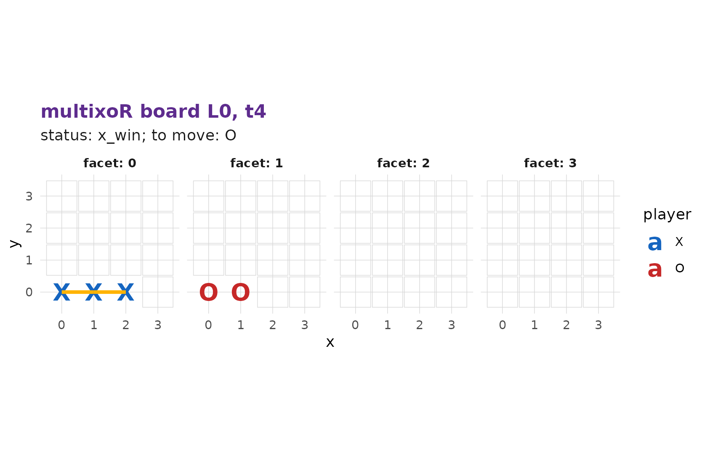
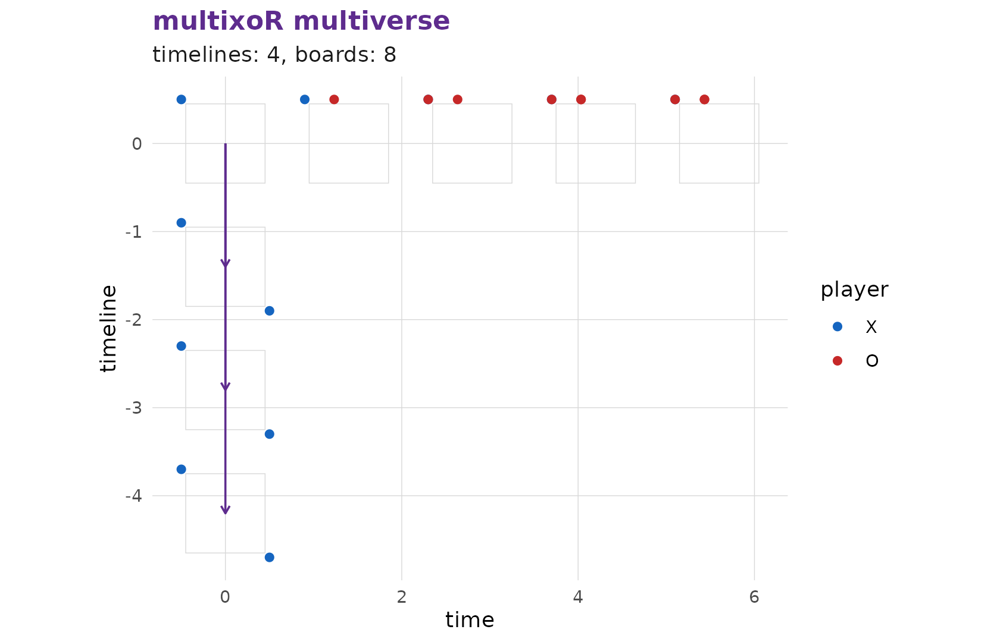
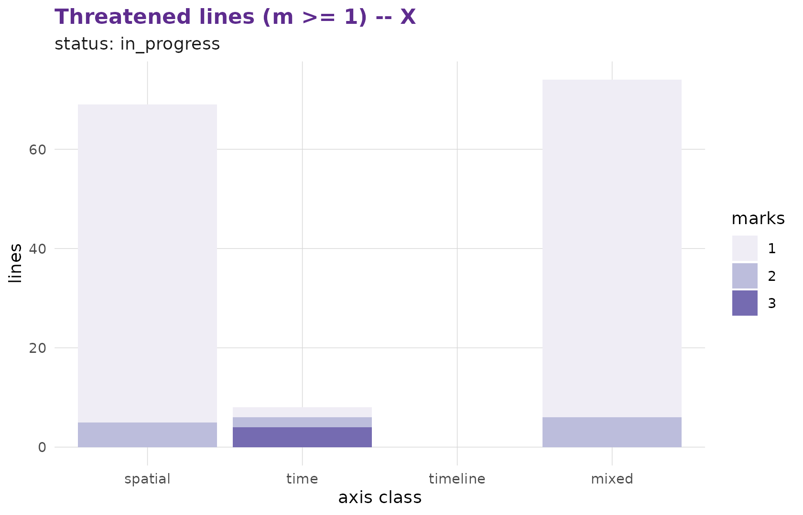

# 4. Winning across space, time and timelines

You now know how to play present moves ([part
2](https://r-heller.github.io/multixoR/articles/tutorial-2-first-game.md))
and how to branch ([part
3](https://r-heller.github.io/multixoR/articles/tutorial-3-branching.md)).
This page is the heart of the game: **how you win.**

## The win condition

A player wins by completing a straight line of `k = 3` of their own
marks along **any** of the game’s axes or diagonals. A “direction” is a
5-vector with entries in `{-1, 0, +1}` (excluding all-zero),
canonicalised so the first non-zero component is positive. In five axes
there are

\frac{3^5 - 1}{2} = 121

such canonical directions:

``` r

nrow(multixoR:::.mxo_directions(3L))
#> [1] 121
```

Because a line can mix the spatial, time, and timeline axes, multixoR
sorts winning (and threatening) lines into four **axis classes**:
`spatial`, `time`, `timeline`, and `mixed`.

## The placement-anchored rule

One subtlety is essential (rules section 5.2.1). When you place a mark,
it exists on that board *and propagates forward* to later boards in the
same timeline. But a win must pass through your **most recent
placement** – propagated cells alone never declare a win. This is why
you cannot simply let a mark “ride forward” through time to complete a
line for free: the line has to be anchored by the move you just made.

## A spatial win

The simplest win is three in a row along a single spatial axis on one
board. Here X builds the `x`-row `(0,0,0)-(1,0,0)-(2,0,0)` while O plays
elsewhere:

``` r

s <- mxo_new_game()
s <- mxo_move(s, "present", 0L, 0L, 0L)    # X (0,0,0)
s <- mxo_move(s, "present", 0L, 1L, 16L)   # O elsewhere
s <- mxo_move(s, "present", 0L, 2L, 1L)    # X (1,0,0)
s <- mxo_move(s, "present", 0L, 3L, 17L)   # O elsewhere
s <- mxo_move(s, "present", 0L, 4L, 2L)    # X (2,0,0) -> completes the line
mxo_status(s)
#> $status
#> [1] "x_win"
#> 
#> $winner
#> [1] 1
#> 
#> $win_line
#> $win_line[[1]]
#> $win_line[[1]]$L
#> [1] 0
#> 
#> $win_line[[1]]$t
#> [1] 4
#> 
#> $win_line[[1]]$idx
#> [1] 0
#> 
#> 
#> $win_line[[2]]
#> $win_line[[2]]$L
#> [1] 0
#> 
#> $win_line[[2]]$t
#> [1] 4
#> 
#> $win_line[[2]]$idx
#> [1] 1
#> 
#> 
#> $win_line[[3]]
#> $win_line[[3]]$L
#> [1] 0
#> 
#> $win_line[[3]]$t
#> [1] 4
#> 
#> $win_line[[3]]$idx
#> [1] 2
```

The status reports `x_win` for player 1. The winning line was completed
on the board at `t = 4` (the moment of the final placement), and
[`mxo_plot_board()`](https://r-heller.github.io/multixoR/reference/mxo_plot_board.md)
highlights that line for a finished game:

``` r

mxo_plot_board(s, L = 0L, t = 4L)
```



## A timeline win

Now the move that has no analogue in ordinary tic-tac-toe: a win along
the **timeline** axis. It requires three placements at the *same*
`(t, idx)` on three adjacent timelines. We branch from the empty opening
board at the same corner cell three times:

``` r

w <- mxo_new_game()
w <- mxo_move(w, "present", 0L, 0L, 0L)
w <- mxo_move(w, "present", 0L, 1L, 1L)
w <- mxo_move(w, "branch",  0L, 0L, 63L)   # X into L1 corner
w <- mxo_move(w, "present", 0L, 2L, 16L)
w <- mxo_move(w, "branch",  0L, 0L, 63L)   # X into L2 corner
w <- mxo_move(w, "present", 0L, 3L, 17L)
w <- mxo_move(w, "branch",  0L, 0L, 63L)   # X into L3 corner -> timeline win
mxo_status(w)$status
#> [1] "x_win"
```

The three corner marks sit at the same spatial cell on timelines 1, 2
and 3 – a line straight along the `L` axis. The multiverse view shows
them stacked across parallel universes:

``` r

mxo_plot_multiverse(w)
```



## The remaining classes: time and mixed

`time`-axis and `mixed` lines exist too – a `time` line runs through the
same cell across successive boards, and a `mixed` line combines spatial
steps with time and/or timeline steps. Because of the placement-anchored
rule above, constructing these by hand takes care, but the engine
detects all five classes with the same machinery. The practical way to
see them coming is to watch your **threatened lines**.

## Reading threats

[`mxo_plot_threats()`](https://r-heller.github.io/multixoR/reference/mxo_plot_threats.md)
counts, per axis class, how many lines a player has partially completed
– the lines that could become wins. Watching this for both players is
the core of multixoR strategy:

``` r

g <- mxo_example_game()
mxo_plot_threats(g, player = 1L, min_marks = 1L)
```



We turn those threats into actual strategy – and hand the job to the
built-in AI – in the next page.

------------------------------------------------------------------------

**Previous:** [3. Branching into the
past](https://r-heller.github.io/multixoR/articles/tutorial-3-branching.md)
 \|  **Next:** [5. Strategy, evaluation and AI
→](https://r-heller.github.io/multixoR/articles/tutorial-5-strategy-ai.md)
