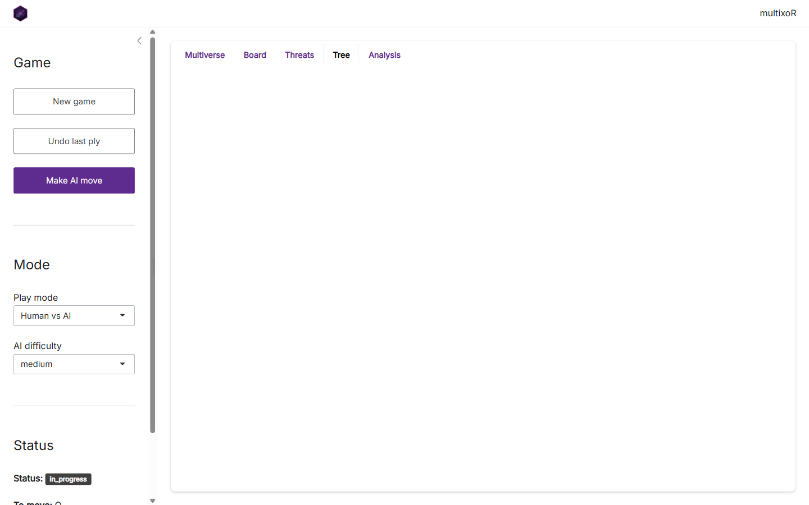
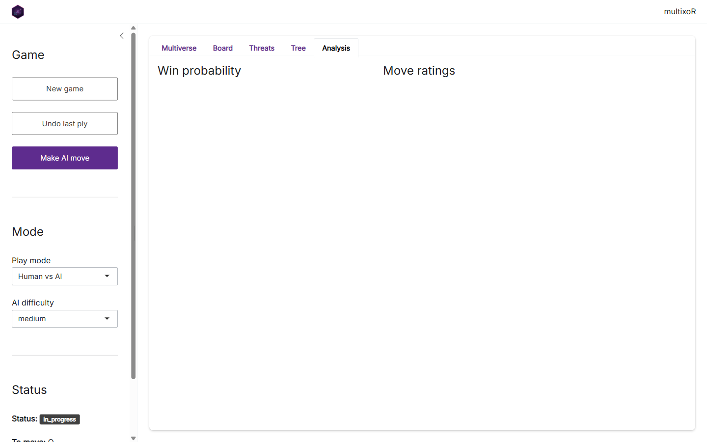

# 6. Playing in the Shiny app

Everything in this tutorial – play, branching, threats, evaluation, and
the AI – is wrapped in a point-and-click **Shiny app**. This final page
is a tour of it. The screenshots below were captured from the live app.

## Launching the app

The app’s optional dependencies (`shiny`, `bslib`, `DT`) live in
`Suggests`, so install them once, then launch:

``` r

# install.packages(c("shiny", "bslib", "DT"))
library(multixoR)
mxo_run_app()
```

[`mxo_run_app()`](https://r-heller.github.io/multixoR/reference/mxo_run_app.md)
opens with the bundled example game already loaded. You can seed it with
your own position via `mxo_run_app(game = my_game)`, and set the AI
strength with `difficulty = "easy" | "medium" | "hard"`.

## The layout


The window has two parts. On the left is the **control sidebar**; on the
right, a set of tabs that visualise the current game. The sidebar has
three sections:

- **Game** – *New game* resets to an empty cube, *Undo last ply* steps
  back one move, and *Make AI move* asks the engine to play the side to
  move.
- **Mode** – choose the *Play mode* (e.g. Human vs AI) and the *AI
  difficulty*. These feed the same
  [`mxo_ai_move()`](https://r-heller.github.io/multixoR/reference/mxo_ai_move.md)
  you met in [part
  5](https://r-heller.github.io/multixoR/articles/tutorial-5-strategy-ai.md).
- **Status** – a live readout of the game state: status, who is to move,
  the ply count, and the number of timelines.

## The Board tab


The **Board** tab is the interactive 3-D cube. Use the *Timeline (L)*
and *Time (t)* inputs to step to any board in the multiverse, and the
*Overlay* selector to paint move ratings (`top3` or a full `heatmap`) on
top of the cells – the same
[`mxo_rate_moves()`](https://r-heller.github.io/multixoR/reference/mxo_rate_moves.md)
data, shown in place. Drag to rotate the cube.

## The Multiverse tab

The opening **Multiverse** tab (shown in the layout screenshot above) is
the timeline-by-time grid from [part
3](https://r-heller.github.io/multixoR/articles/tutorial-3-branching.md),
with branch connectors drawn in. It is the fastest way to see the whole
game at once and to spot where universes have split.

## The Threats tab


The **Threats** tab is the live version of
[`mxo_plot_threats()`](https://r-heller.github.io/multixoR/reference/mxo_plot_threats.md):
per-axis-class counts of each player’s near-complete lines. This is the
panel to watch while deciding your next move.

## The Tree tab



The **Tree** tab draws the branching history as a tree of board states –
handy when a game has spawned several timelines and the grid view gets
busy.

## The Analysis tab



The **Analysis** tab surfaces the numeric engine: the position’s
evaluation and win probability, and the ranked table of legal moves. It
is
[`mxo_evaluate()`](https://r-heller.github.io/multixoR/reference/mxo_evaluate.md),
[`mxo_win_prob()`](https://r-heller.github.io/multixoR/reference/mxo_win_prob.md),
and
[`mxo_rate_moves()`](https://r-heller.github.io/multixoR/reference/mxo_rate_moves.md)
from [part
5](https://r-heller.github.io/multixoR/articles/tutorial-5-strategy-ai.md),
without writing any code.

## Where to go next

That completes the tour. From here:

- Read the [Rules and 5D
  geometry](https://r-heller.github.io/multixoR/articles/rules-and-geometry.md)
  article for the formal specification.
- Browse the [function
  reference](https://r-heller.github.io/multixoR/reference/index.md) for
  the full API.
- Or just run
  [`mxo_run_app()`](https://r-heller.github.io/multixoR/reference/mxo_run_app.md)
  and start branching.

------------------------------------------------------------------------

**Previous:** [5. Strategy, evaluation and
AI](https://r-heller.github.io/multixoR/articles/tutorial-5-strategy-ai.md)
 \|  **Back to:** [1. The board and the five
axes](https://r-heller.github.io/multixoR/articles/tutorial-1-the-board.md)
