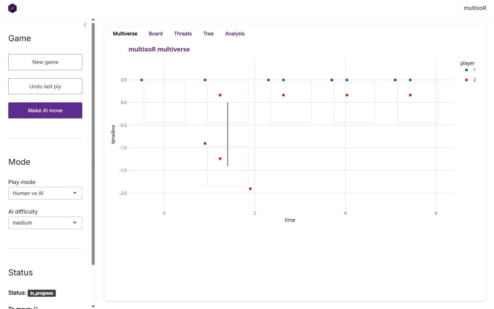
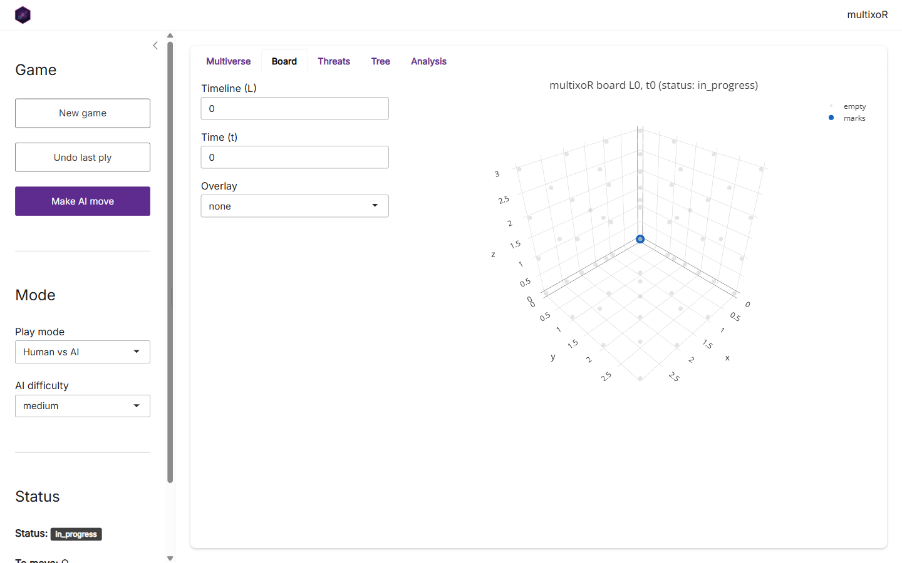
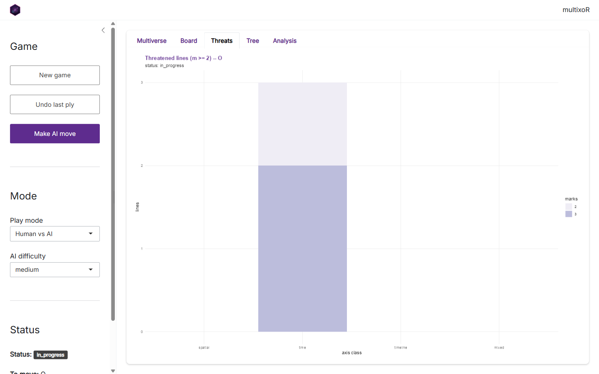

```{r setup, include = FALSE}
knitr::opts_chunk$set(
  collapse = TRUE, comment = "#>", echo = FALSE, out.width = "100%"
)
```

Everything in this tutorial -- play, branching, threats, evaluation, and the AI
-- is wrapped in a point-and-click **Shiny app**. This final page is a tour of
it. The screenshots below were captured from the live app.

## Launching the app

The app's optional dependencies (`shiny`, `bslib`, `DT`) live in `Suggests`,
so install them once, then launch:

```{r launch, echo = TRUE, eval = FALSE}
# install.packages(c("shiny", "bslib", "DT"))
library(multixoR)
mxo_run_app()
```

`mxo_run_app()` opens with the bundled example game already loaded. You can
seed it with your own position via `mxo_run_app(game = my_game)`, and set the
AI strength with `difficulty = "easy" | "medium" | "hard"`.

## The layout

```{r overview}

```

The window has two parts. On the left is the **control sidebar**; on the right,
a set of tabs that visualise the current game. The sidebar has three sections:

- **Game** -- *New game* resets to an empty cube, *Undo last ply* steps back one
  move, and *Make AI move* asks the engine to play the side to move.
- **Mode** -- choose the *Play mode* (e.g. Human vs AI) and the *AI difficulty*.
  These feed the same `mxo_ai_move()` you met in
  [part 5](tutorial-5-strategy-ai.html).
- **Status** -- a live readout of the game state: status, who is to move, the
  ply count, and the number of timelines.

## The Board tab

```{r board}

```

The **Board** tab is the interactive 3-D cube. Use the *Timeline (L)* and
*Time (t)* inputs to step to any board in the multiverse, and the *Overlay*
selector to paint move ratings (`top3` or a full `heatmap`) on top of the
cells -- the same `mxo_rate_moves()` data, shown in place. Drag to rotate the
cube.

## The Multiverse tab

The opening **Multiverse** tab (shown in the layout screenshot above) is the
timeline-by-time grid from [part 3](tutorial-3-branching.html), with branch
connectors drawn in. It is the fastest way to see the whole game at once and to
spot where universes have split.

## The Threats tab

```{r threats}

```

The **Threats** tab is the live version of `mxo_plot_threats()`: per-axis-class
counts of each player's near-complete lines. This is the panel to watch while
deciding your next move.

## The Tree tab

```{r tree}
knitr::include_graphics("img/app-tree.png")
```

The **Tree** tab draws the branching history as a tree of board states -- handy
when a game has spawned several timelines and the grid view gets busy.

## The Analysis tab

```{r analysis}
knitr::include_graphics("img/app-analysis.png")
```

The **Analysis** tab surfaces the numeric engine: the position's evaluation and
win probability, and the ranked table of legal moves. It is `mxo_evaluate()`,
`mxo_win_prob()`, and `mxo_rate_moves()` from
[part 5](tutorial-5-strategy-ai.html), without writing any code.

## Where to go next

That completes the tour. From here:

- Read the [Rules and 5D geometry](rules-and-geometry.html) article for the
  formal specification.
- Browse the [function reference](../reference/index.html) for the full API.
- Or just run `mxo_run_app()` and start branching.

---

**Previous:** [5. Strategy, evaluation and AI](tutorial-5-strategy-ai.html) &nbsp;|&nbsp;
**Back to:** [1. The board and the five axes](tutorial-1-the-board.html)
